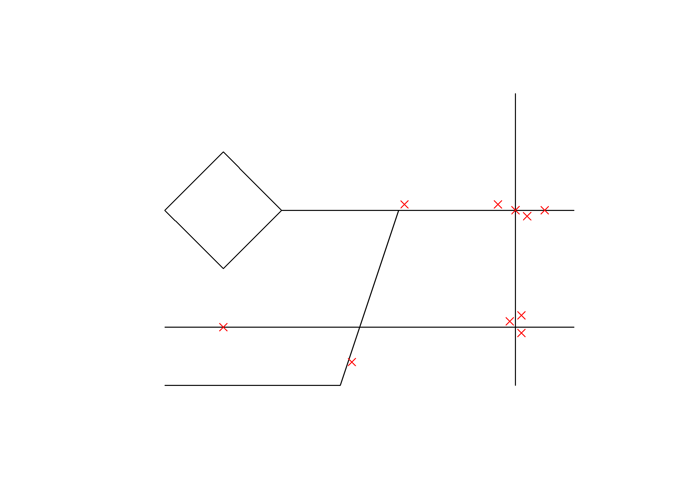
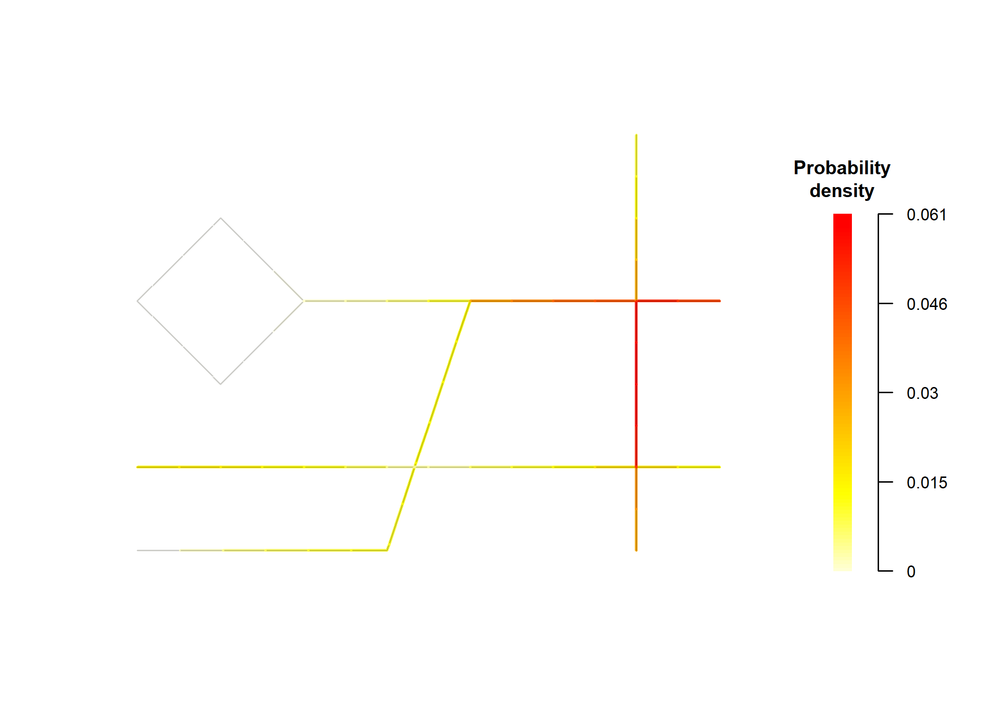

<!-- README.md is generated from README.Rmd. Please edit that file -->

# pavement 

<!-- badges: start -->

[](https://lifecycle.r-lib.org/articles/stages.html#experimental)
[](https://CRAN.R-project.org/package=pavement)
[](https://app.codecov.io/gh/NONONOexe/pavement?branch=main)
<!-- badges: end -->

## Overview

pavement is a package designed to analyze spatial events occurring on
roadways. It provides comprehensive toolkit for working with spatial
data, empowering users to understand patterns and trends in road-related
phenomena.

## Installation

You can install the development version of pavement using the following
methods:

### Using `install.packages()` (R-universe)

``` r
# Enable the R-universe
options(repos = c(
  nononoexe = "https://nononoexe.r-universe.dev",
  cran = "https://cloud.r-project.org"
))

# Install the package
install.packages("pavement")
```

### Using `pak`

``` r
# install.packages("pak")
pak::pak("nononoexe/pavement")
```

## Usage

This example demonstrates how to visualize the distribution of roads and
traffic accidents using pavement:

``` r
library(pavement)

segmented_network <- sample_roads |>
  create_road_network() |>
  set_events(sample_accidents) |>
  create_segmented_network(segment_length = 0.5) |>
  convolute_segmented_network()
#> Warning in transform_coordinates(spatial_object, target = "cartesian", quiet =
#> quiet): CRS is missing. Returning the input object without transformation.
plot(segmented_network, mode = "event")
```



``` r
plot(segmented_network, mode = "count")
```


``` r
plot(segmented_network, mode = "density")
```



## Code of conduct

Please note that this project is released with a [Contributor Code of
Conduct](https://nononoexe.github.io/pavement/CODE_OF_CONDUCT.html). By
participating in this project you agree to abide by its terms.
